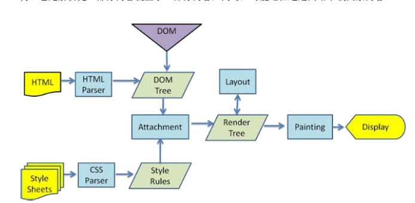

# 从输入URL到页面加载发生了什么？
1. DNS解析
2. TCP连接
3. 发送HTTP请求
4. 服务器处理请求并返回HTTP报文
5. 浏览器解析渲染页面
6. 连接结束

## DNS解析
   DNS解析的过程就是寻找哪台机器上有你需要资源的过程。当你在浏览器中输入一个地址时，例如www.baidu.com，其实不是百度网站真正意义上的地址。互联网上每一台计算机的唯一标识是它的IP地址，但是IP地址并不方便记忆。用户更喜欢用方便记忆的网址去寻找互联网上的其它计算机，也就是上面提到的百度的网址。所以互联网设计者需要在用户的方便性与可用性方面做一个权衡，这个权衡就是一个网址到IP地址的转换，这个过程就是DNS解析。它实际上充当了一个翻译的角色，实现了网址到IP地址的转换。网址到IP地址转换的过程是如何进行的?
   
   DNS解析是一个递归查询的过程。
   
## DNS优化

### DNS缓存
    DNS存在着多级缓存，从离浏览器的距离排序的话，有以下几种: 浏览器缓存，系统缓存，路由器缓存，IPS服务器缓存，根域名服务器缓存，顶级域名服务器缓存，主域名服务器缓存。
### DNS负载均衡
   不知道大家有没有思考过一个问题: DNS返回的IP地址是否每次都一样？如果每次都一样是否说明你请求的资源都位于同一台机器上面，那么这台机器需要多高的性能和储存才能满足亿万请求呢？其实真实的互联网世界背后存在成千上百台服务器，大型的网站甚至更多。但是在用户的眼中，它需要的只是处理他的请求，哪台机器处理请求并不重要。DNS可以返回一个合适的机器的IP给用户，例如可以根据每台机器的负载量，该机器离用户地理位置的距离等等，这种过程就是DNS负载均衡，又叫做DNS重定向。大家耳熟能详的CDN(Content Delivery Network)就是利用DNS的重定向技术，DNS服务器会返回一个跟用户最接近的点的IP地址给用户，CDN节点的服务器负责响应用户的请求，提供所需的内容。在这里打个免费的广告，我平时使用的比较多的是七牛云的CDN(免费)储存图片，作为我个人博客的图床使用。
   
## TCP连接三次握手

也是我们常说的“三次握手”（听说过这个概念吗）
每次建立连接前，客户端和服务端之前都要先进行三次对话才开始正式传输内容。
这个问题的本质是：客户端和服务端之间的通信渠道并不可靠， 但是通信双方需要就某个问题达成一致。而要解决这个问题, 无论你在消息中包含什么信息, 三次通信是理论上的最小值。

为了保证服务端能收接受到客户端的信息，并能做出正确的应答而进行前两次(第一次和第二次)握手，为了保证客户端能够接收到服务端的信息，并能做出正确的应答而进行后两次(第二次和第三次)握手。
## 四次挥手 
   三次握手是建立TCP连接，四次挥手是终止TCP连接。
   TCP 的连接的拆除需要发送四个包，因此称为四次挥手(Four-way handshake)，也叫做改进的三次握手。客户端或服务器均可主动发起挥手动作，四次挥手的过程可以形象地理解为一问一答，双方都经过了这个过程就可以结束这个连接了。
   
   简单理解版本：
   1、客户端 -> 服务端 ： 我要关闭连接咯
   2、服务端 -> 客户端 : 好的
   3、服务端 -> 客户端 ： 我要关闭连接咯
   4、服务端 -> 客户端 : 好的
   
## **浏览器解析渲染页面**

浏览器在收到HTML,CSS,JS文件后，它是如何把页面呈现到屏幕上的？下图对应的就是WebKit渲染的过程。

浏览器是一个边解析边渲染的过程。

首先浏览器解析HTML文件构建DOM树，然后解析CSS文件构建渲染树，等到渲染树构建完成后，浏览器开始布局渲染树并将其绘制到屏幕上。

这个过程比较复杂，涉及到两个概念: reflow(回流)和repain(重绘)。

DOM节点中的各个元素都是以盒模型的形式存在，这些都需要浏览器去计算其位置和大小等，这个过程称为relow;当盒模型的位置,大小以及其他属性，如颜色,字体,等确定下来之后，浏览器便开始绘制内容，这个过程称为repain。

页面在首次加载时必然会经历reflow和repain。reflow和repain过程是非常消耗性能的，尤其是在移动设备上，它会破坏用户体验，有时会造成页面卡顿。所以我们应该尽可能少的减少reflow和repain。

## JS的解析是由浏览器中的JS解析引擎完成的。

JS是单线程运行，也就是说，在同一个时间内只能做一件事，所有的任务都需要排队，前一个任务结束，后一个任务才能开始。

但是又存在某些任务比较耗时，如IO读写等，所以需要一种机制可以先执行排在后面的任务，这就是：同步任务(synchronous)和异步任务(asynchronous)。

JS的执行机制就可以看做是一个主线程加上一个任务队列(task queue)。

同步任务就是放在主线程上执行的任务，异步任务是放在任务队列中的任务。

所有的同步任务在主线程上执行，形成一个执行栈;异步任务有了运行结果就会在任务队列中放置一个事件；脚本运行时先依次运行执行栈，然后会从任务队列里提取事件，运行任务队列中的任务，这个过程是不断重复的，所以又叫做事件循环(Event loop)。

浏览器在解析过程中，如果遇到请求外部资源时，如图像,iconfont,JS等。

浏览器将重复1-6过程下载该资源。请求过程是异步的，并不会影响HTML文档进行加载，但是当文档加载过程中遇到JS文件，HTML文档会挂起渲染过程，不仅要等到文档中JS文件加载完毕还要等待解析执行完毕，才会继续HTML的渲染过程。原因是因为JS有可能修改DOM结构，这就意味着JS执行完成前，后续所有资源的下载是没有必要的，这就是JS阻塞后续资源下载的根本原因。

CSS文件的加载不影响JS文件的加载，但是却影响JS文件的执行。JS代码执行前浏览器必须保证CSS文件已经下载并加载完毕。

## Web优化

上面部分主要介绍了一次完整的请求对应的过程，了解该过程的目的无非就是为了Web优化。

在谈到Web优化之前，我们回到一个更原始的问题，Web前端的本质是什么。

我的理解是: 将信息快速并友好的展示给用户并能够与用户进行交互。

快速的意思就是在尽可能短的时间内完成页面的加载，试想一下当你在淘宝购买东西的时候，淘宝页面加载了10几秒才显示出物品，这个时候你还有心情去购买吗？怎么快速的完成页面的加载呢？

### 如何尽快的加载资源？

答案就是能不从网络中加载的资源就不从网络中加载，当我们合理使用缓存，将资源放在浏览器端，这是最快的方式。

如果资源必须从网络中加载，则要考虑缩短连接时间，即DNS优化部分;减少响应内容大小，即对内容进行压缩。

另一方面，如果加载的资源数比较少的话，也可以快速的响应用户。

当资源到达浏览器之后，浏览器开始进行解析渲染，浏览器中最耗时的部分就是reflow，所以围绕这一部分就是考虑如何减少reflow的次数。

### 如何加快首屏渲染，你有哪些方案?

- 降低请求量：合并资源，减少 HTTP 请求数，minify / gzip 压缩，webP，lazyload。
- 加快请求速度：预解析DNS，减少域名数，并行加载，CDN 分发。
- 增加缓存：HTTP 协议缓存请求，离线缓存 manifest，离线数据缓存 localStorage、PWA。
- 渲染优化：首屏内容最小化，JS/CSS优化，加载顺序，服务端渲染，pipeline。

### 性能优化从哪些方面入手？

- 分屏加载，当页面需要渲染的数据较多时，先渲染首屏，下滑时再加载第二屏的数据；
- 图片大小优化，在不影响视觉效果的前提下，把图片尺寸降到最小；
- 图片懒加载，on appear时再加载图片；
- Code splitting，或者拆包，应用下的某些组件不需要立刻import，可以采用动态import的方式，打包时也可以将它们打到不同的bundle里，给index bundle瘦身；
- Chrome Devtools - Trace & Timeline等一系列强大的分析工具可以去研究一下，它们可以深入到内核分析应用的性能问题所在；
