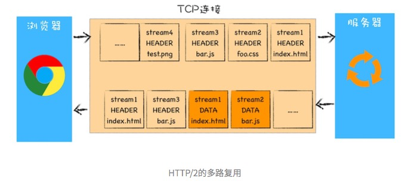

# HTTP 缓存有哪几种？

## HTTP 1.0
### 缓存
为了减轻服务器的压力，在 HTTP/1.0 中提供了 Cache 机制。

- `Expires`：强制缓存。缓存服务器上的过期时间。

    -   用来指定资源到期的时间
    -   问题：受限于本地时间。如果用户改了本地时间，就没用了

- `Last-Modified`：协商缓存。
    
    -   资源在服务器上的最后修改时间。
    -   问题：一个资源被修改了，但其实际内容根本没发生改变，也会返回整个实体给客户端（即使客户端缓存里有个一模一样的资源）。
    
> 客户端会为资源标记上该信息，下次再次请求时，会把该信息附带在请求报文中一并带给服务器去做检查，若传递的时间值与服务器上该资源最终修改时间是一致的，则说明该资源没有被修改过，直接返回304状态码，内容为空，这样就节省了传输数据量 。如果两个时间不一致，则服务器会发回该资源并返回200状态码，和第一次请求时类似。这样保证不向客户端重复发出资源，也保证当服务器有变化时，客户端能够得到最新的资源。一个304响应比一个静态资源通常小得多，这样就节省了网络带宽。

## HTTP/1.1
随着技术的发展，很快 HTTP/1.0 也不能满足需求了。

- `Cache-Control`： 强制缓存 

    - `Expires` http1.1 新增了 Cache-Control 来定义缓存过期时间 `max-age=3600`。
    
    注意：若报文中同时出现了 `Expires` 和 `Cache-Control`，则以 Cache-Control 为准。

- `ETag`：协商缓存：根据内容计算出的唯一标识符

    - 为了解决上述 `Last-Modified` 可能存在的不准确的问题，Http1.1 还推出了 ETag 实体首部字段。
 
## 强制缓存 与 协商缓存
1. 浏览器在加载资源时，根据请求头的 `expires` 和 `cache-control` 判断是否命中强缓存，是则直接从缓存读取资源，不会发请求到服务器。
 
2. 如果没有命中强缓存，浏览器一定会发送一个请求到服务器，通过 `last-modified` 和 `etag` 验证资源是否命中协商缓存，如果命中，服务器会将这个请求返回，但是不会返回这个资源的数据，依然是从缓存中读取资源

3.如果前面两者都没有命中，直接从服务器加载资源 

## http1 vs http2
多路复用、服务器推送、强制开启https

###  多路复用

- 每个请求都有一个对应的 ID
    
    - 如stream1表示index.html的请求，stream2表示foo.css的请求。
    
    - 这样在浏览器端，就可以随时将请求发送给服务器了。
    
    - 是因为每份数据都有对应的ID，服务器端返回的顺序可以不固定。
    
    - 浏览器接收到之后，会筛选出相同ID的内容，将其拼接为完整的HTTP响应数据。

### 服务器推送

- 将数据提前推送到浏览器。

    - 比如 用户请求一个HTML⻚面
    
    - 服务器知道该HTML⻚面会引用几个重要的JavaScript文件和CSS文件
    
    - 服务器直接把这些资源都发送给浏览器
    
    - 当浏览器解析完HTML文件之后，就能直接拿到需要的CSS文件和JavaScript文件
    
    - 这对首次打开⻚面的速度起到了至关 重要的作用。
    
### 强制开启https

### 头部压缩

