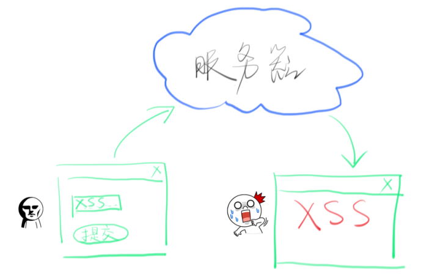

# 安全问题
## csrf
CSRF(Cross Site Request Forgery) 即跨站请求伪造。

攻击者盗用了你的身份，以你的名义发送恶意请求。

原因：浏览器会自动带上用户的 Cookie。

### 一个例子 🌰
　银行网站A，它以GET请求来完成银行转账的操作，如：http://www.mybank.com/Transfer.php?toBankId=11&money=1000

　　危险网站B，它里面有一段HTML的代码如下：

　　``

　　首先，你登录了银行网站A，然后访问危险网站B，噢，这时你会发现你的银行账户少了1000块......

### 防范
- 客户端防范：对于数据库的修改请求，全部使用POST提交，禁止使用GET请求。
            post 请求带上 token

- 服务器端防范：一般做法是在表单里面添加一段隐藏的唯一的token(请求令牌)。

## xss

1.xss (cross site scripting) 即跨站脚本。

比如在有表单输入的地方，用户输入了类似``的东西，而服务器没有经过过滤就保存下来了，别的用户看到网页就会弹出提示框。

当然，xss攻击还可以做其他更加复杂的事情。比如，获取cookie。

2.把`<`和`>`转换为`html`字符实体可以防范大多数xss攻击。可以使用js过滤，也可以在服务器端过滤。
