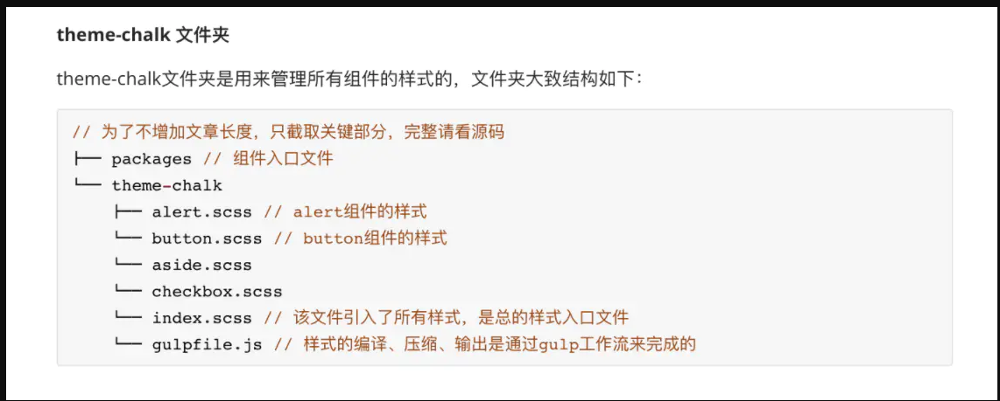

# vue3 项目介绍

## [自定义块](https://vue-loader.vuejs.org/zh/guide/custom-blocks.html)

## 自定义指令
v-click-outside

## 响应式 API
reactive、readonly、ref、watchEffect、

## 组合式 API
setup
Provide / Inject
生命钩子 onX

## 内置组件
component、slot、telecport

## 组件设计有什么原则？
[面试官(6): 写过『通用前端组件』吗?](https://juejin.im/post/6844903847874265101#heading-1)
### 细粒度的考量
我们在学习设计模式的时候会遇到很多种设计原则,其中一个设计原则就是单一职责原则。
在组件库的开发中同样适用,我们原则上一个组件只专注一件事情,单一职责的组件的好处很明显,由于职责单一就可以最大可能性地复用组件,但是这也带来一个问题,过度单一职责的组件也可能会导致过度抽象,造成组件库的碎片化。

举个例子，一个自动完成组件(AutoComplete),他其实是由 Input 组件和 Select 组件组合而成的,因此我们完全可以复用之前的相关组件,就比如 Antd 的AutoComplete组件中就复用了Select组件,同时Calendar、 Form 等等一系列组件都复用了 Select 组件,那么Select 的细粒度就是合适的,因为 Select 保持的这种细粒度很容易被复用.

那么还有一个例子,一个徽章数组件(Badge),它的右上角会有红点提示,可能是数字也可能是 icon,他的职责当然也很单一，这个红点提示也理所当然也可以被单独抽象为一个独立组件,但是我们通常不会将他作为独立组件,因为在其他场景中这个组件是无法被复用的，因为没有类似的场景再需要小红点这个小组件了，所以作为独立组件就属于细粒度过小,因此我们往往将它作为 Badge 的内部组件,比如在 Antd 中它以ScrollNumber的名称作为Badge的内部组件存在。

所以，所谓的单一职责组件要建立在可复用的基础上，对于不可复用的单一职责组件我们仅仅作为独立组件的内部组件即可。

# 通用性考量
## 按需加载
### 原理

按需加载，本质上是把一个组件库的不同组件拆分成不同文件，按照需要引用对应的文件，而该文件暴露一个install方法，供Vue.use使用。
 
比如：我只想引用element库里的一个Button组件

```js
import Button from 'element-ui/lib/Button.js'
import Button from 'element-ui/lib/theme-chalk/Button.css'

Vue.use(Button);
```

`element` 使用一个了 `babel-plugin-component` 插件，作用就是代码转换：

```
import { Button } from 'components'

// 转换为

var button = require('components/lib/button')
require('components/lib/button/style.css')
```

### 编写规范

index.js 中定义全部加载的 install 方法

```js
import Button from './src/main';

Button.install = function(Vue) {
  Vue.component(Button.name, Button);
};

export default Button;
```

### webpack配置

#### 多入口

每个组件独立生成一个对应的js和css，这就需要我们在入口处就把组件的引用定义好：

##### webpack.prod.conf.js:
```js
const entrys = {
    Button: path.resolve(__dirname, '../packages/Button'),
    index: path.resolve(__dirname, '../packages')
};
// 上述配置每增加一个组件都需要修改entrys，我们可以优化一下，使其动态生成：

const entrys = require(./getComponents.js)([组件目录入口]);

const webpackConfig = merge(baseWebpackConfig, {
  entry: entrys,
  // ......
});
```
##### getComponents.js:

```js
const fs = require('fs');
const path = require('path');

/**
 * 判断刚路径是否含有index.js
 * @param {String} dir 
 */
function hasIndexJs(dir) {
    let dirs = [];
    try {
        dirs = fs.readdirSync(dir);
    } catch(e) {
        dirs = null;
    }
    return dirs && dirs.includes('index.js');
}

/**
 * 获取指定入口和入口下包含index.js的文件夹的路径
 * @param {String} entryDir 
 */
const getPath = function(entryDir) {
    let dirs = fs.readdirSync(entryDir);
    
    const result = {
        index: entryDir
    };
    dirs = dirs.filter(dir => {
        return hasIndexJs(path.resolve(entryDir, dir));
    }).forEach(dir => {
        result[dir] = path.resolve(entryDir, dir); 
    });
    return result;
}

module.exports = getPath;
```

### css 按需加载
按需打包


**- 其实只要把packages/theme-chalk下的所有scss都编译成css就可以了**

**- 当你需要全局引入的时候，就去引入index.scss文件，这样所有组件的样式都齐全了。**

**- 如果你想按需引入，比如按需引入button组件，那么只要引入button.scss文件，就可以了。**

**- 那么如何把packages/theme-chalk下的所有scss都编译成css？（Element是如何打包样式的？）**

**- 所以ElementUI的样式打包，并不是用webpack的，是用了gulp，基于工作流去处理样式。**

我们看看Element如何结合gulp去使用
> gulp vs webpack
> webpack 为大型 SPA 而生的，模块处理路线。而如果需要将图片，样式，字体等所有静态资源全部打包
> gulp 对大量源文件进行流式处理
> rollup 只做一件事，打包 js。构建一个库


```js
'use strict';

const { series, src, dest } = require('gulp');
const sass = require('gulp-sass'); // 编译gulp工具
const autoprefixer = require('gulp-autoprefixer');// 添加厂商名字工具
const cssmin = require('gulp-cssmin'); // 压缩css工具

function compile() {
  return src('./src/*.scss') // 引入src下所有的scss样式
    .pipe(sass.sync()) // 把scss文件编译成css
    .pipe(autoprefixer({ // 基于目标浏览器版本，添加厂商前缀
      browsers: ['ie > 9', 'last 2 versions'],
      cascade: false
    }))
    .pipe(cssmin()) // 压缩css
    .pipe(dest('./lib')); // 输出到lib下
}

function copyfont() {
  return src('./src/fonts/**') // 读取src/fonts下的所有文件
    .pipe(cssmin()) // 压缩
    .pipe(dest('./lib/fonts')); // 输出到lib/fonts下
}

exports.build = series(compile, copyfont);
```

最终就会帮我们打包出了样式文件。`gen-cssfile.js`

根据 `components.json`，生成 `package/theme-chalk/index.scss`，把所有组件的样式都导入到 `index.scss`
这样每次新增组件，就不用手动去引入新增组建的样式了

`cp-cli packages/theme-chalk/lib lib/theme-chalk`
## 多种模块

- `UMD`：`UMD` 版本可以通过 `<script>` 标签直接用在浏览器中。

- `CommonJS`：`CommonJS` 版本用来配合老地打包工具比如 Browserify 或 webpack 1。
    这些打包工具的默认文件 (pkg.main) 是只包含运行时的 CommonJS 版本 (`vue.runtime.common.js`)。

- `ES Module`：从 2.6 开始 Vue 会提供两个 `ES Modules (ESM)` 构建文件：

    -   为打包工具提供的 ESM：为诸如 `webpack 2` 或 `Rollup` 提供的现代打包工具。
    
    -   ESM 格式被设计为可以被静态分析，所以打包工具可以利用这一点来进行`“tree-shaking”`并将用不到的代码排除出最终的包。为这些打包工具提供的默认文件 (pkg.module) 是只有运行时的 ES Module 构建 (`vue.runtime.esm.js`)。

    -   为浏览器提供的 ESM (2.6+)：用于在现代浏览器中通过 `<script type="module">` 直接导入。
    
    
## 自定义主题色功能
https://juejin.im/post/6847902225377787918

## 代码规范问题 
### ESLint 代码格式规范
在 webpack 中配置并开启 eslint-loader 错误提示，

基本规范是依托于 vue 官方的 eslint 规则

### Git Hooks commit 规范

### tsconfig 的配置

### 自动构建命令
新建文件、自动发布

#### 新建文件
```bash
make new <component-name> [中文] 这个命令
```
这是用来创建一个新的组件的，然后这个命令会帮我们基于新建好的组件，帮我们进行一系列的自动化操作
当运行这个命令的时候，其实运行的是 `node build/bin/new.js`

new.js脚本主要做了下面几件事：

1. 把你新建的组件添加到 components.json
2. 添加到 index.scss
3. 添加到 element-ui.d.ts
4. 创建 package
5. 添加到 nav.config.json

所以当我们要在 element 架构上，新建一个 elect-bill 组件
只要执行 make new elect-bill 电子账号，然后不用配置，就可以直接去开发了

#### 自动发布

### 版本号

版本号的格式为 X.Y.Z(又称 Major.Minor.Patch)，递增的规则为：

- X 表示主版本号，当 API 的兼容性变化时，X 需递增。
- Y 表示次版本号，当增加功能时(不影响 API 的兼容性)，Y 需递增。
- Z 表示修订号，当做 Bug 修复时(不影响 API 的兼容性)，Z 需递增。

## vue3 新特性
- proxy、首次不深拷贝
- diff 静态不 diff
- vue3 vs react 过时的闭包问题
