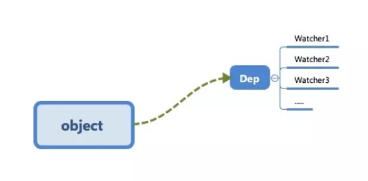

# 双向数据绑定原理

## vue2 

https://github.com/su37josephxia/vue3-study/tree/master/demo/reactivity-demo

 vue 2 的实现方式是通过 `Object.defineProperty` 来重新定义 `getter/setter` 方法实现
 
-   getter 收集依赖，setter 调用更新回调（是发布订阅 有中介）

    - getter
     
        - 「 依赖收集」的目的是将观察者 Watcher 对象存放到当前闭包中的订阅者 Dep 的 subs 中。 形成如下所示的这样一个关系。
    
    - setter
   
      - 修改对象的值，会触发对应的 setter
 
      - setter通知之前「依赖收集」得到的 Dep 中的每一个 Watcher，告诉它们自己的值改变了，需要重新渲染视图。这时候这些 Watcher 就会开始调用update来 更新视图，
          
        - 这中间还有一个 `patch` 的过程以及使用队列来异步更新的策略

 当然还有两个重要的问题 需要处理
 - 第一个就是这样做只能做浅层响应 也就是如果是第二层就不行了。
   - 解决办法：递归调用，递归也带来了性能上的极大损失
   
 - 然后是数组问题 数组问题我们可以通过函数劫持的方式解决

 ### v-model
      
-   v-model 是 v-bind 和 v-on 的语法糖。

    -   v-bind 即 model=>view，当model数据发生变化，在setter中，去触发对应组件重新生成Vnode，对比新旧虚拟树，更新差异。

    -   v-on 即 view=>model view操作后，触发事件，调用回调函数，在回调函数中更新model
 
-   Model 改变 View的过程： 依赖于ES5的`object.defineProperty`，通过 `defineProperty` 实现的数据劫持，
    
 
-   View 改变 Model的过程： 依赖于 v-model ,该语法糖实现是在单向数据绑定的基础上，增加事件监听并赋值给对应的Model
   


 ## vue 3
 使用ES6的Proxy方式来解决这个问题

 首先Proxy是支持数组的，也就是数组不需要做特别的处理。
 对于深层监听也不不必要使用递归的方式解决。

 当get是判断值为对象时，做响应式处理返回就可以了。
 这个并不不是发生在初始化的时候，而是设置值得时候，所以性能上得到很大的提升。
 
## 完整代码
```html
<!DOCTYPE html>
<html lang="en">

<head>
  <meta charset="UTF-8">
  <meta name="viewport" content="width=device-width, initial-scale=1.0">
  <title>Document</title>
</head>

<body>
  <input id="input" type="text"/>
  <div id="text"></div>

  <script>
    /*
      v-model是 v-bind 和 v-on 的语法糖。
      v-bind 即 model=>view，当model数据发生变化，在setter中，去触发对应组件重新生成Vnode，对比新旧虚拟树，更新差异。
      v-on 即 view=>model view操作后，触发事件，调用回调函数，在回调函数中更新model
    */
   /*
    Model 改变 View的过程： 依赖于ES5的object.defineProperty，通过 defineProperty 实现的数据劫持，
    getter 收集依赖，setter 调用更新回调（不同于观察者模式，是发布订阅 有中介）
      - getter 「依赖收集」会让 text1 这个数据知道“哦～有两个地方依赖我的数据，我变化的时候需要通知它们～”。

        - 「 依赖收集」的目的是将观察者 Watcher 对象存放到当前闭包中的订阅者 Dep 的 subs 中。 形成如下所示的这样一个关系。

      - setter
  
         - 修改对象的值，会触发对应的 setter

         - setter通知之前「依赖收集」得到的 Dep 中的每一个 Watcher，告诉它们自己的值改变了，需要重新渲染视图。这时候这些 Watcher 就会开始调用update来 更新视图，当然这中间还有一个 patch 的过程以及使用队列来异步更新的策略，这个我们后面再讲。
 
    View 改变 Model的过程： 依赖于 v-model ,该语法糖实现是在单向数据绑定的基础上，增加事件监听并赋值给对应的Model
   */
    let input = document.getElementById("input");
    let text = document.getElementById("text");
    let data = { value: "" };
    // let changeName = new Proxy(data, {
    //   set(obj, name, value){
    //     console.log(obj, name, value)
    //     obj[name] = value;
    //     render()
    // })
    Object.defineProperty(data, "value", {
      set: function (val) {
        render()
      },
      get: function () {
        return input.value;
      }
    });
    input.onkeyup = function (e) {
      data.value = e.target.value;
      // changeName[name] = data.value
    };
    function render () {
      text.innerHTML = val;
      input.value = val;
    }
  </script>

</body>

</html>
```
## data 为什么 return
- 当一个组件被定义， data 必须声明为返回一个初始数据对象的函数，因为组件可能被用来创建多个实例。
- 如果 data 仍然是一个纯粹的对象，则所有的实例将共享引用同一个数据对象！
- 通过提供 data 函数，每次创建一个新实例后，我们能够调用 data 函数，从而返回初始数据的一个全新副本数据对象。
